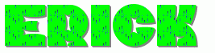

<!--
**esmaigua/esmaigua** is a ✨ _special_ ✨ repository because its `README.md` (this file) appears on your GitHub profile.

Here are some ideas to get you started:

- 🔭 I’m currently working on ...
- 🌱 I’m currently learning ...
- 👯 I’m looking to collaborate on ...
- 🤔 I’m looking for help with ...
- 💬 Ask me about ...
- 📫 How to reach me: ...
- 😄 Pronouns: ...
- ⚡ Fun fact: ...
-->

<h1 align="center">Hi there 👋, I'm esmaigua</h1>

- 🎓 Information Systems Engineering Student  
- 📍 Central University of Ecuador  
- 💻 Passionate about web development, backend development, and databases

## 🛠️ Technologies and Tools

 
 
 
 
 
 
 

## 📊 GitHub Stats

## 🚀 My Featured Projects
- 🔗 [Personal Project](https://github.com/JojoUce/proyectoDesarrollo.git)
- 📱 [Redis Project](https://github.com/esmaigua/REDIS-API.git)

## 🌱 Currently Learning
I'm strengthening my knowledge of full-stack development and databases.

## 🔍 Fun Fact

✨ *I love learning, coding, and repeating the cycle.* ✨

---

## 🌐 Connect with me

  

